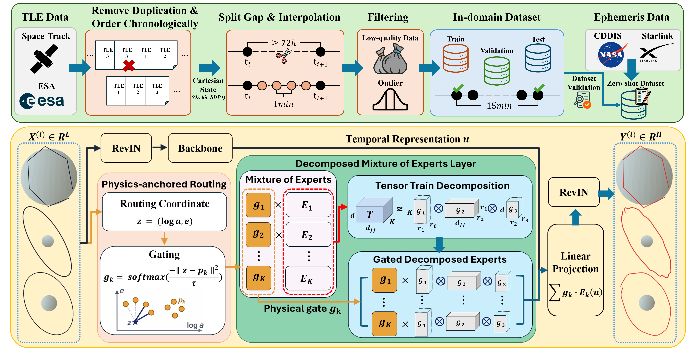

# MrSOP

This is the official implementation of the ICLR 2027 paper **"MrSOP: A Multi-Regime Satellite Orbit Prediction Model Based on Tensor Decomposition"**.

# Contribution

MrSOP addresses satellite orbit forecasting across diverse orbital regimes with a single model. Built on TimeMixer, it combines physics-anchored routing with a Decomposed Mixture of Experts (DMoE). The router uses semi-major axis and eccentricity recovered from the input trajectory, while Tensor-Train decomposition reduces the parameter cost of the expert networks. The main model uses 16 experts and requires no orbital-regime label at inference. We evaluate MrSOP on a TLE-derived dataset of 18,004 satellites across LEO, MEO, NSO, and GEO, and on Starlink, GNSS, and BeiDou ephemerides for zero-shot forecasting.

# Architecture

<div align="center">
  
</div>

# Dependencies

Install Python 3.10 or newer and a PyTorch build suitable for your CPU or CUDA environment. Then install the dependencies:

```bash
pip install -r requirements.txt
```

Run the following commands from the repository root. Datasets and pretrained weights are not included.

# Data Preparation

Collect historical TLE records from [Space-Track](https://www.space-track.org/) and reconstruct Cartesian state sequences at 1-minute intervals using an orbital propagation tool such as [Orekit](https://www.orekit.org/).

Save each continuous trajectory segment as a NumPy `.npy` array with shape `[T, 6]` and columns `x, y, z, vx, vy, vz`. Use positions in kilometers and velocities in kilometers per second, expressed in a consistent Earth-centered inertial frame. Split trajectories at data gaps, and assign each satellite to only one of the training, validation, or test sets.

Then create one manifest per split, `data/train.csv`, `data/val.csv`, and `data/test.csv`. Each row of a manifest points to one trajectory segment in a `.npy` array. For example, `data/train.csv` looks like this:

```csv
path,seg_start,seg_end,regime
orbits/leo_example.npy,0,10000,LEO
orbits/gnss_example.npy,0,10000,NSO
```

With this manifest, the expected directory layout is:

```text
data/
├── train.csv
├── val.csv
├── test.csv
└── orbits/
    ├── leo_example.npy     # shape [T, 6], T >= 10000
    └── gnss_example.npy
```

| Column | Description |
|---|---|
| `path` | Path to the `.npy` array. A relative path is resolved against the directory that contains the manifest. |
| `seg_start` | First row of the segment (inclusive). |
| `seg_end` | End row of the segment (exclusive). It must not exceed the number of rows in the array. |
| `regime` | One of `LEO`, `MEO`, `NSO`, or `GEO`. The label is used for regime-balanced sampling and per-regime reporting, not for model routing. |

To check the pipeline without real data, `python examples/make_demo_data.py` writes synthetic manifests, arrays, and ephemeris CSV files to `data/demo/`.

The default configuration samples every 15th state from the 1-minute trajectories. Each window uses 192 input steps and 96 forecast steps, corresponding to 48 hours of context and a 24-hour forecast horizon.

# Training

Train using the manuscript training schedule:

```bash
python train.py --config configs/mrsop_paper.yaml
```

# Inference

```bash
python inference.py --config configs/mrsop_paper.yaml \
  --checkpoint checkpoints/mrsop_paper_best.pt \
  --input data/input.npy \
  --output outputs/prediction.npy \
  --device cuda
```

# Evaluation

## In-domain

Evaluate on the in-domain test manifest:

```bash
python evaluate.py --config configs/mrsop_paper.yaml
```

## Zero-shot

For zero-shot evaluation, prepare ephemeris CSV files with columns `epoch_ms, x, y, z, vx, vy, vz` in kilometers and kilometers per second. Use the same coordinate frame as the training data. The released evaluation assumes TEME states.

```bash
python evaluate_zeroshot.py --config configs/mrsop_paper.yaml \
  --checkpoint checkpoints/mrsop_paper_best.pt \
  --source starlink --data-dir data/starlink --device cuda

python evaluate_zeroshot.py --config configs/mrsop_paper.yaml \
  --checkpoint checkpoints/mrsop_paper_best.pt \
  --source gnss --data-dir data/gnss --device cuda

python evaluate_zeroshot.py --config configs/mrsop_paper.yaml \
  --checkpoint checkpoints/mrsop_paper_best.pt \
  --source beidou --data-dir data/beidou --device cuda
```